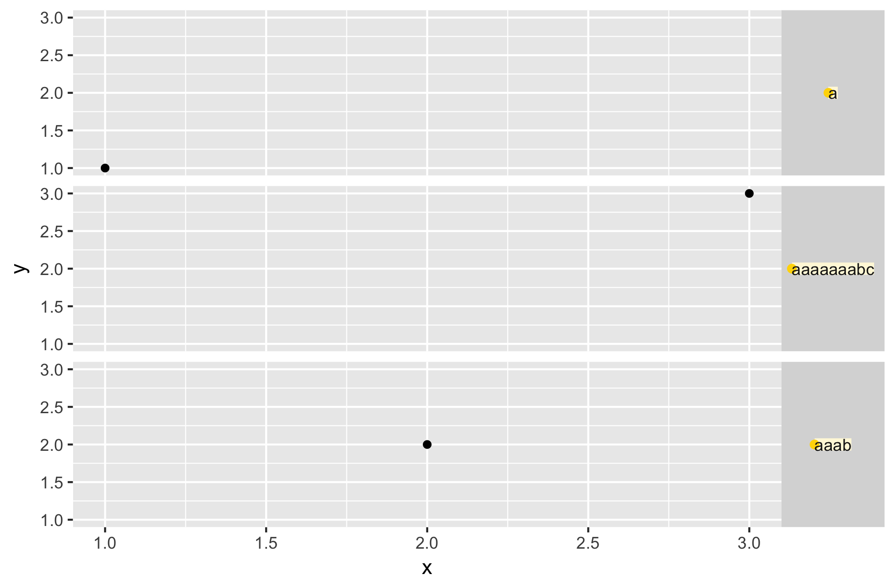
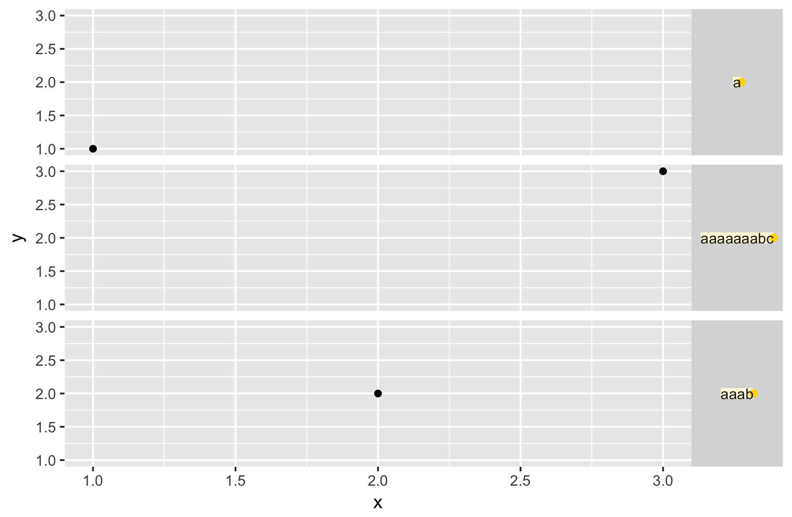

```{r knitr-setup, include=FALSE}
knitr::opts_chunk$set(echo = TRUE,
                      message = FALSE,
                      warning = FALSE,
                      fig.path = "figs/",
                      fig.align = "center",
                      fig.asp = 0.618,
                      out.width = "50%",
                      dev = "png")
```

```{r load-pkgs}
## Normally I wouldn't install a package in RMD code, but I want to make sure
## this doc isn't using whatever local version of ggplot2 I'm working on
devtools::install_github("tidyverse/ggplot2")

library("grid")
library("gridDebug")
library("ggplot2")
library("gridExtra")
```

## Issues 

A lot of current issues relate to the margins around text elements:

-   [1502 - Using \`margin\` to adjust \`legend.text\`?](https://github.com/tidyverse/ggplot2/issues/1502)
-   [1887 - Margins don't affect strip.text](https://github.com/tidyverse/ggplot2/issues/1887)
-   [1892 - vjust not working in x facets](https://github.com/tidyverse/ggplot2/issues/1892)
-   [1903 - Length of legend title affects justification of legend keys/labels?](https://github.com/tidyverse/ggplot2/issues/1903)


This document will systematically review the behavior of `titleGrob()`, the
function that places text elements everywhere (?) except facet labels (those are
handled by `stripGrob()`).

### Some outstanding questions:

- Why don't margins work in strip text?
- Why are `hjust` and `vjust` interpreted differently for strip text vs. other
  text?
  See
  [this comment](https://github.com/tidyverse/ggplot2/issues/1892#issuecomment-316192474):
  strip text interprets `hjust` and `vjust` in absolute terms rather than
  relative to the direction of the text.
- Why don't margins work in legend titles/labels? (It's partially because
  `expand_x` and `expand_y` are `FALSE`, so `titleGrob()` doesn't add the
  margins -- but we can't just fix this by making those arguments `TRUE` because
  of
  [this](https://github.com/tidyverse/ggplot2/commit/7be4c8944bca845c9b9e189ec8c44231f6b4dc2b#commitcomment-15795870))
- Is `stripGrob()` redundant? Can we remove it and use `titleGrob()` instead?

First I need to figure out how text placement works. Here's a plot to use for
exploration:

```{r iris-plot}
## A plot
p <- ggplot(iris, aes(x = Sepal.Width, y = Sepal.Length)) +
  facet_wrap(~ Species) +
  geom_point(aes(colour = Species))
```

Since understanding `titleGrob()` requires understanding some of the `grid`
graphics package, here are some functions that might help inspect grid objects.

```{r grid-debugging-tools, out.width = "80%"}
p

## Grid debugging tools
grid.ls()
showGrob()
gridTree()
```

`element_text()` also has a `debug = TRUE` argument.

```{r debug-true, out.width = "80%"}
## Text elements with debug = TRUE
p +
  theme(
    axis.title = element_text(debug = TRUE),
    strip.text = element_text(debug = TRUE), # uses stripGrob, not titleGrob 
    legend.title = element_text(debug = TRUE)
  )
```

## titleGrob() definition

My first step is to go line by line through `titleGrob()` and add a bunch of
comments to make sure I understand what it is doing. My comments begin with
`##`.

```{r titlegrob-comments, eval = FALSE}
titleGrob <- function(label, x, y, hjust, vjust, angle = 0, gp = gpar(),
                      margin = NULL, expand_x = FALSE, expand_y = FALSE,
                      debug = FALSE) {

  ## titleGrob is for drawing text elements with the text controlled by `label`,
  ## so if there is no label then this should return an empty grob
  if (is.null(label))
    return(zeroGrob())

  ## Set all margins to zero if they are null
  if (is.null(margin)) {
    margin <- margin(0, 0, 0, 0)
  }

  ## angle values should be within 0-360
  angle <- angle %% 360

  ## hjust and vjust control horizontal and vertical justification relative to
  ## the x and y location. x/y positions don't care about rotation of the text,
  ## so this translates hjust and vjust into the correct x/y positions.
  if (angle == 90) { ## 90 degrees CCW
    xp <- 1 - vjust
    yp <- hjust
  } else if (angle == 180) {
    xp <- 1 - hjust
    yp <- 1 - vjust
  } else if (angle == 270) {
    xp <- vjust
    yp <- 1 - hjust
  } else {
    xp <- hjust
    yp <- vjust
  }

  n <- max(length(x), length(y), 1) ## Chooses the longest of x, y, and 1
  x <- x %||% unit(rep(xp, n), "npc") ## if x is null, replace with value of xp
                                      ## in "npc" units n times
  y <- y %||% unit(rep(yp, n), "npc") ## if y is null, replace with value of yp
                                      ## in "npc" units n times

  ## Create text grob for each value in `label` and the corresponding x/y
  ## position, with the specified justification, rotated by `angle`, with any
  ## additional graphical parameter settings
  text_grob <- textGrob(label, x, y, hjust = hjust, vjust = vjust,
    rot = angle, gp = gp)

  # The grob dimensions don't include the text descenders, so add on using
  # a little trigonometry. This is only exactly correct when vjust = 1.
  descent <- descentDetails(text_grob)
  text_height <- unit(1, "grobheight", text_grob) + cos(angle / 180 * pi) * descent
  text_width <- unit(1, "grobwidth", text_grob) + sin(angle / 180 * pi) * descent

  ## If the debug = TRUE option is used, add yellow rectangle behind the text
  ## and point where the text is anchored.
  if (isTRUE(debug)) {
    children <- gList(
      rectGrob(gp = gpar(fill = "cornsilk", col = NA)),
      pointsGrob(x, y, pch = 20, gp = gpar(col = "gold")),
      text_grob
    )
  } else {
    children <- gList(text_grob)
  }

  if (expand_x && expand_y) {
    ## If expand_x and expand_y, create variable `widths` with 3 elements: the
    ## left margin, the text width, and the right margin. Create variable
    ## `heights` with 3 elements: top margin, height, bottom margin.
    widths <- unit.c(margin[4], text_width, margin[2])
    heights <- unit.c(margin[1], text_height, margin[3])

    ## Create viewport and split into 3x3 sub-regions based on widths and heights
    vp <- viewport(layout = grid.layout(3, 3, heights = heights, widths = widths), gp = gp)
    ## child_vp viewport is at [2, 2] in the grid layout of the `vp` viewport
    child_vp <- viewport(layout.pos.row = 2, layout.pos.col = 2)
  } else if (expand_x) {
    ## If expand_x only, do like the above but only creating a 1x3 layout (left
    ## margin, text width, right margin)
    widths <- unit.c(margin[4], text_width, margin[2])
    vp <- viewport(layout = grid.layout(1, 3, widths = widths), gp = gp)
    child_vp <- viewport(layout.pos.col = 2)

    heights <- unit(1, "null")
  } else if (expand_y) {
    ## If expand_y only, do like the above but oly creating a 3x1 layout (top
    ## margin, text height, bottom margin)
    heights <- unit.c(margin[1], text_height, margin[3])

    vp <- viewport(layout = grid.layout(3, 1, heights = heights), gp = gp)
    child_vp <- viewport(layout.pos.row = 2)

    widths <- unit(1, "null")
  } else {
    ## If neither expand_x nor expand_y, return `children`, which may contain
    ## just the text_grob or may also contain debugging grobs
    widths <- text_width
    heights <- text_height
    return(
      gTree(
        children = children,
        widths = widths,
        heights = heights,
        cl = "titleGrob"
      )
    )
  }

  ## If at least one of expand_x and expand_y are TRUE (i.e. `children` hasn't
  ## already been returned) then create gTree
  gTree(
    children = children,               ## children, i.e. text_grob elements
    vp = vpTree(vp, vpList(child_vp)), ## vpTree with parent vp grid at top then
                                       ## child_vp
    widths = widths,                   ## Widths of the vp
    heights = heights,                 ## Heights of the vp
    cl = "titleGrob"
  )
}
```

## titleGrob() usage

Next I'll experiment a little to see where `titleGrob()` is getting called, and
generally how it is being used. `titleGrob()` gets called by
`element_grob.element_text()` (in `R/theme-elements.r`). I ran the code below in
an interactive session and poked around a bit. For plot `p` it gets called 12
times:

```{r trace-titleGrob, eval = FALSE}
trace(ggplot2:::titleGrob)
p
trace(ggplot2:::titleGrob, recover)     # See the calling functions
p
```

- 3 calls are for the x axes
- 3 calls are for the y axes
- 2 axis titles
- 1 legend title
- 3 legend labels

So that makes sense. The only other text items are the facet labels, which are
handled by `stripGrob()`.

I also looked through the codebase for instances of `expand_x` and `expand_y`.
These appear in:

- `R/layout.R` in the `render_labels()` method of `Layout` for creating axis
  titles, I believe (line 250)
    - If it's an x label: `expand_y` is `TRUE` -- padding gets added on top and
      bottom
    - If it's a y label: `expand_x` is `TRUE` -- padding gets added to left and
      right
- `R/guides-axis.r` when creating axis tick labels (line 47)
- `R/guide-legend.r` creating `grob.title` and `grob.labels` (lines 311 and 339)
    - Both `expand_x` and `expand_y` are false in these cases
    
`geom_text` calls `grid::textGrob()` directly, so `titleGrob()` isn't used for
things like text annotations.

## stripGrob()

`stripGrob()` behaves a little differently from `titleGrob()`, so I'll work
through it as well.

```{r strip-grob, eval = FALSE}
stripGrob <- function(label, hjust, vjust, angle = 0, gp = gpar(),
                      margin = NULL, debug = FALSE) {
  ## Create margins of 0 if margin = NULL
  if (is.null(margin)) {
    margin <- margin() ## margin() defaults to margin(0, 0, 0, 0)
  }

  ## Create text grob. In titleGrob() we specify the x/y positions; here in
  ## stripGrob() they default to unit(0.5, "npc"), i.e. the center of the
  ## current viewport
  text_grob <- textGrob(label, rot = angle, gp = gp)

  ## Create variable `widths` with 3 elements: the left margin, the text width,
  ## and the right margin. Create variable `heights` with 3 elements: top
  ## margin, height, bottom margin.
  widths <- unit.c(margin[4], unit(1, "grobwidth", text_grob), margin[2])
  heights <- unit.c(margin[1], unit(1, "grobheight", text_grob), margin[3])

  ## Create viewport. hjust and vjust set both the x/y locations of the viewport
  ## and the justification of the viewport relative to its x/y location
  vp <- viewport(
    hjust, vjust, just = c(hjust, vjust),
    width = sum(widths), ## width is the sum of the widths object
    height = sum(heights), ## height is the sum of the heights object
    ## Create 3x3 layout using widths and heights
    layout = grid.layout(3, 3, heights = heights, widths = widths), 
    name = "top"
  )

  ## child_vp is the center cell of the viewport
  child_vp <- viewport(layout.pos.row = 2, layout.pos.col = 2) 

  ## Add the debugging stuff if debug = TRUE
  if (debug) {
    children <- gList(
      rectGrob(gp = gpar(fill = "cornsilk", col = NA)),
      pointsGrob(unit(hjust, "npc"), unit(vjust, "npc"), pch = 20,
        gp = gpar(col = "gold")),
      text_grob
    )
  } else {
    children <- gList(text_grob)
  }

  gTree(
    children = children,                ## children (i.e. text_grob elements)
    vp = vpTree(vp, vpList(child_vp)),  ## vpTree with parent vp grid at top
                                        ## then child_vp
    widths = widths,                    ## widths of the vp
    heights = heights,                  ## heights of the vp
    cl = "stripGrob"
  )
}
```

## titleGrob experiments

```{r tg-helper-fun}
## Helper function for displaying titleGrob
display_tg <- function(label, x = 0.5, y = 0.5, ..., showgrob = FALSE) {
  tg <- ggplot2:::titleGrob(label, x, y, ..., debug = TRUE)
  grid.newpage()
  grid.rect()                       # Just so there's a border around the figure
  grid.draw(tg)
  if (showgrob) {
    showGrob(gPath = "titleGrob", grep = TRUE)
  }
}
```

Let's look at some `titleGrob()`s

```{r display-titlegrob}
gp <- gpar(fontsize = 20)

## First some simple titleGrobs
display_tg("pineapple", hjust = 0, vjust = 0, gp = gp)
display_tg("pineapple", hjust = 0, vjust = 0, angle = 45, gp = gp)
```

This is interesting --
before [#2212](https://github.com/tidyverse/ggplot2/pull/2212) these appeared as
just the word `pineapple` in the center of the image, because debugging output
didn't work when `expand_x` and `expand_y` were false. Now the debugging works,
but it's interesting that the point is all the way at the top left. The point
*should* appear at `(x, y)`, which is `(0.5, 0.5)` in this case. Although
`pointsGrob` uses `"native"` as its default units, not `"npc"`, so maybe this
makes sense.

```{r display-titlegrob-expand}
## Add expand_x, expand_y, and margins and view showGrob() overlay
display_tg(
  "pineapple",
  hjust = 0,
  vjust = 0,
  expand_x = TRUE,
  expand_y = TRUE,
  margin = margin(3, 3, 3, 3),
  gp = gp,
  showgrob = TRUE
)
grid.ls(viewports = TRUE, fullnames = TRUE)
```

The `grid.ls()` output shows that we beneath the root we have a `rect` and a
viewport. Within the viewport is a child viewport as well as a `titleGrob` class
object which has the text grob and debugging grobs as children.

```{r childnames}
## childNames of a titleGrob object is the text object
childNames(
  ggplot2:::titleGrob(
    "pineapple",
    0.5,
    0.5,
    hjust = 0,
    vjust = 0,
    expand_x = TRUE,
    expand_y = TRUE,
    margin = margin(3, 3, 3, 3)
  )
)
```

What happens if we expand the margins?

```{r display-titlegrob-wider-margins}
display_tg(
  "pineapple",
  hjust = 0,
  vjust = 0,
  expand_x = TRUE,
  expand_y = TRUE,
  margin = margin(20, 20, 20, 20),
  gp = gp,
  showgrob = TRUE
)
```

What happens when we vary `expand_x` and `expand_y`:

```{r titlegrob-expand}
display_tg(
  "pineapple",
  hjust = 0,
  vjust = 0,
  expand_x = FALSE,
  expand_y = TRUE,
  margin = margin(20, 20, 20, 20),
  gp = gp,
  showgrob = TRUE
)


display_tg(
  "pineapple",
  hjust = 0,
  vjust = 0,
  expand_x = TRUE,
  expand_y = FALSE,
  margin = margin(20, 20, 20, 20),
  gp = gp,
  showgrob = TRUE
)
```

Also hjust and vjust:

```{r titlegrob-just}
display_tg(
  "pineapple",
  hjust = 0.5,
  vjust = 0,
  expand_x = TRUE,
  expand_y = TRUE,
  margin = margin(20, 20, 20, 20),
  gp = gp,
  showgrob = TRUE
)

display_tg(
  "pineapple",
  hjust = 0,
  vjust = 0.5,
  expand_x = TRUE,
  expand_y = TRUE,
  margin = margin(20, 20, 20, 20),
  gp = gp,
  showgrob = TRUE
)
```

How do rotation and hjust/vjust interact? Things are likely to be weird given
that there are special cases for when `angle` is 90, 180, or 270, and fallback
behavior for every angle in between. 

`titleGrob()` uses `hjust` and `vjust` to determine x and y position in when x/y
are `NULL`. For all angles except 90, 180, and 270, it uses the value of `hjust`
for x and `vjust` for y. Some examples:

```{r rotation-just}
display_tg(
  "pineapple",
  x = NULL,                             # Becomes 1 - vjust
  y = NULL,                             # Becoems hjust
  hjust = 0.2,
  vjust = 0.2,
  angle = 90,
  expand_x = TRUE,
  expand_y = TRUE,
  margin = margin(20, 20, 20, 20),
  gp = gp,
  showgrob = TRUE
)

display_tg(
  "pineapple",
  x = NULL,                             # Becomes 1 - hjust
  y = NULL,                             # Becomes 1 - vjust
  hjust = 0.2,
  vjust = 0.2,
  angle = 180,
  expand_x = TRUE,
  expand_y = TRUE,
  margin = margin(20, 20, 20, 20),
  gp = gp,
  showgrob = TRUE
)

display_tg(
  "pineapple",
  x = NULL,                             # Becomes hjust
  y = NULL,                             # Becomes vjust
  hjust = 0.2,
  vjust = 0.2,
  angle = 220,
  expand_x = TRUE,
  expand_y = TRUE,
  margin = margin(20, 20, 20, 20),
  gp = gp,
  showgrob = TRUE
)
```

Let's view some titleGrobs in context on some plots. How does changing the
margins affect these text elements? I'll start by looking at axis titles. Here's
how a plot normally looks.

```{r axis-title-margin, out.width = "80%"}
## Simple plot
p <- ggplot(iris, aes(Sepal.Width, Sepal.Length)) +
  geom_point() +
  theme(plot.background = element_rect(size = 1, color = "grey"))

p + theme(axis.title = element_text(debug = TRUE))
```

Changing the margins of `axis.title` has no effect:

```{r axis-title-margin-2, out.width = "80%"}
## Change margin of axis titles -- this has no effect...
p +
  theme(axis.title = element_text(margin = margin(20, 20, 20, 20), debug = TRUE))
```

But you can change the margins by altering `axis.title.x` or `axis.title.y`:

```{r axis-title-margin-3, out.width = "80%"}
grid.arrange(
  p +
    theme(axis.title.x = element_text(margin = margin(20, 20, 20, 20), debug = TRUE)),
  p +
    theme(axis.title.y = element_text(margin = margin(20, 20, 20, 20), debug = TRUE)),
  ncol = 2
)
```

`vjust` for axis titles also only takes effect when working with `axis.title.x`
or `axis.title.y` (not just plain `axis.title`):

```{r axis-title-vjust, out.width = "80%"}
## Change vjust - no effect on axis.title...
p + theme(axis.title = element_text(vjust = 0, debug = TRUE))

## ...but can change vjust for axis.title.x and axis.title.y
grid.arrange(
  p + theme(axis.title.x = element_text(vjust = 0, debug = TRUE)),
  p + theme(axis.title.y = element_text(vjust = 0, debug = TRUE)),
  ncol = 2
)
```

This doesn't actually change the placement of the text, but that is expected
(see [#1435](https://github.com/tidyverse/ggplot2/issues/1435)).

`hjust` works fine with `axis.title` it seems.

```{r axis-title-hjust, out.width = "80%"}
## Change hjust
p + theme(axis.title = element_text(hjust = 0, debug = TRUE)) 
p + theme(axis.title = element_text(hjust = 1, debug = TRUE))
```

## Why does stripGrob need its own function?

`stripGrob()` is essentially a special case of `titleGrob()`; does it really
need to be a separate function? All of the differences are fairly superficial:

- `stripGrob()` uses `hjust` and `vjust` to set both the x/y position and
  justification. This could be done by just passing `hjust` and `vjust` to the
  `x` and `y` arguments of `titleGrob()`
- `stripGrob()` always creates a viewport with a 3x3 layout, essentially the
  same behavior as `titleGrob()` with `expand_x` and `expand_y` set to `TRUE`
- I believe the only change that will have any visual ramifications is that
  `stripGrob()` does not include descenders in its calculations of text height
  and width. This seems like a bug to me; it seems better to be consistent about
  adding that extra padding.

I think we could fairly easily replace `stripGrob()`, though doing so breaks the
visual tests because the facet strips change size a little bit. It also prevents
`hjust` and `vjust` from having any effect on the placement of text within the
strip...

### How should margins and justification work in strip labels?

Example from [1286](https://github.com/tidyverse/ggplot2/issues/1286):

```{r strip-label-just, out.width = "80%"}
df <- data.frame(x = 1:3, y = 1:3, z = c("a", "aaab", "aaaaaaabc"))

base <- ggplot(df, aes(x, y)) + 
  geom_point() + 
  theme(strip.text.y = element_text(angle = 0))

base + facet_grid(z ~ .) + theme(strip.text.y = element_text(hjust = 0, debug = TRUE))
base + facet_grid(z ~ .) + theme(strip.text.y = element_text(hjust = 1, debug = TRUE))
```

The equivalent versions of these plots after removing `stripGrob()` and using
`titleGrob()` instead is:


```{r without-stripgrob, out.width = "80%", echo = FALSE}


```

The text is centered no matter what the `hjust` or `vjust` value is. This seems
like it might be related to [this issue](https://github.com/tidyverse/ggplot2/commit/7be4c8944bca845c9b9e189ec8c44231f6b4dc2b#commitcomment-15795870), but I'm not sure.
