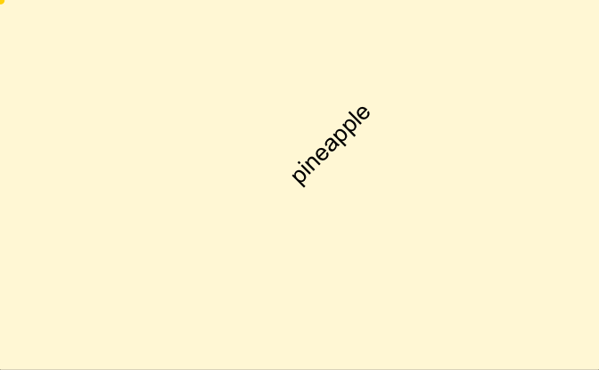
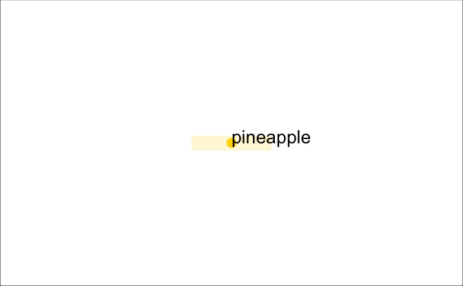
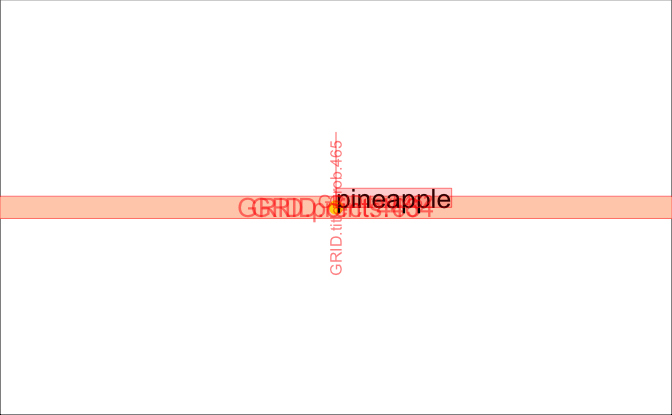
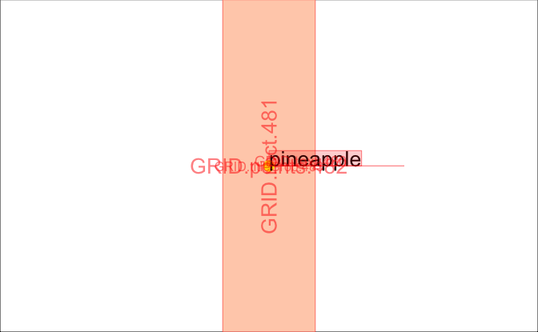
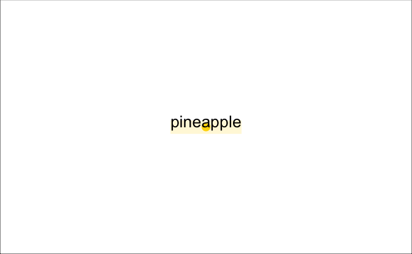
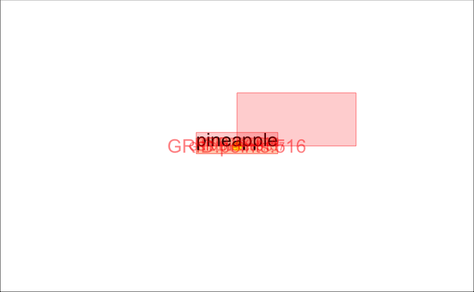

titleGrob()
================
Kara Woo
14 July, 2017

``` r
library("grid")
library("gridDebug")
library("ggplot2")
```

This document will systematically review the behavior of `titleGrob()`, the function that places text elements everywhere (?) except facet labels (those are handled by `stripGrob()`). Here's a plot to use for exploration:

``` r
## A plot
p <- ggplot(iris, aes(x = Sepal.Width, y = Sepal.Length)) +
  facet_wrap(~ Species) +
  geom_point(aes(colour = Species))
```

Since understanding `titleGrob()` requires understanding some of the `grid` graphics package, here are some functions that might help inspect grid objects.

``` r
p
```


``` r
## Grid debugging tools
grid.ls()
```

    ## layout

``` r
showGrob()
```


``` r
gridTree()
```


`element_text()` also has a `debug = TRUE` argument.

``` r
## Text elements with debug = TRUE
p +
  theme(
    axis.title = element_text(debug = TRUE),
    strip.text = element_text(debug = TRUE), # uses stripGrob, not titleGrob 
    legend.title = element_text(debug = TRUE) # debug = TRUE has no effect here
  )
```


titleGrob() definition
----------------------

My first step is to go line by line through `titleGrob()` and add a bunch of comments to make sure I understand what it is doing. My comments begin with `##`.

``` r
titleGrob <- function(label, x, y, hjust, vjust, angle = 0, gp = gpar(),
                      margin = NULL, expand_x = FALSE, expand_y = FALSE,
                      debug = FALSE) {

  ## titleGrob is for drawing text elements with the text controlled by `label`,
  ## so if there is no label then this should return an empty grob
  if (is.null(label))
    return(zeroGrob())

  ## Set all margins to zero if they are null
  if (is.null(margin)) {
    margin <- margin(0, 0, 0, 0)
  }

  ## angle values should be within 0-360
  angle <- angle %% 360

  ## hjust and vjust control horizontal and vertical justification relative to
  ## the x and y location. x/y positions don't care about rotation of the text,
  ## so this translates hjust and vjust into the correct x/y positions.
  if (angle == 90) { ## 90 degrees CCW
    xp <- 1 - vjust
    yp <- hjust
  } else if (angle == 180) {
    xp <- 1 - hjust
    yp <- 1 - vjust
  } else if (angle == 270) {
    xp <- vjust
    yp <- 1 - hjust
  } else {
    xp <- hjust
    yp <- vjust
  }

  n <- max(length(x), length(y), 1) ## Chooses the longest of x, y, and 1
  x <- x %||% unit(rep(xp, n), "npc") ## if x is null, replace with value of xp
                                      ## in "npc" units n times
  y <- y %||% unit(rep(yp, n), "npc") ## if y is null, replace with value of yp
                                      ## in "npc" units n times

  ## Create text grob for each value in `label` and the corresponding x/y
  ## position, with the specified justification, rotated by `angle`, with any
  ## additional graphical parameter settings
  text_grob <- textGrob(label, x, y, hjust = hjust, vjust = vjust,
    rot = angle, gp = gp)

  # The grob dimensions don't include the text descenders, so add on using
  # a little trigonometry. This is only exactly correct when vjust = 1.
  descent <- descentDetails(text_grob)
  text_height <- unit(1, "grobheight", text_grob) + cos(angle / 180 * pi) * descent
  text_width <- unit(1, "grobwidth", text_grob) + sin(angle / 180 * pi) * descent

  if (expand_x && expand_y) {
    ## If expand_x and expand_y, create variable `widths` with 3 elements: the
    ## left margin, the text width, and the right margin. Create variable
    ## `heights` with 3 elements: top margin, height, bottom margin.
    widths <- unit.c(margin[4], text_width, margin[2])
    heights <- unit.c(margin[1], text_height, margin[3])

    ## Create viewport and split into 3x3 sub-regions based on widths and heights
    vp <- viewport(layout = grid.layout(3, 3, heights = heights, widths = widths), gp = gp)
    ## child_vp viewport is at [2, 2] in the grid layout of the `vp` viewport
    child_vp <- viewport(layout.pos.row = 2, layout.pos.col = 2)
  } else if (expand_x) {
    ## If expand_x only, do like the above but only creating a 1x3 layout (left
    ## margin, text width, right margin)
    widths <- unit.c(margin[4], text_width, margin[2])
    vp <- viewport(layout = grid.layout(1, 3, widths = widths), gp = gp)
    child_vp <- viewport(layout.pos.col = 2)

    heights <- unit(1, "null")
  } else if (expand_y) {
    ## If expand_y only, do like the above but oly creating a 3x1 layout (top
    ## margin, text height, bottom margin)
    heights <- unit.c(margin[1], text_height, margin[3])

    vp <- viewport(layout = grid.layout(3, 1, heights = heights), gp = gp)
    child_vp <- viewport(layout.pos.row = 2)

    widths <- unit(1, "null")
  } else {
    ## If neither expand_x nor expand_y, return the original text_grob
    return(text_grob)
  }

  ## If the debug = TRUE option is used, add yellow rectangle behind the text
  ## and point where the text is anchored. BUT I suppose this does not ever get
  ## evaluated if text_grob was already returned above (which is why it doesn't
  ## show up in the legend labels above)
  if (debug) {
    children <- gList(
      rectGrob(gp = gpar(fill = "cornsilk", col = NA)),
      pointsGrob(x, y, pch = 20, gp = gpar(col = "gold")),
      text_grob
    )
  } else {
    children <- gList(text_grob)
  }

  ## If at least one of expand_x and expand_y are TRUE (i.e. text_grob hasn't
  ## already been returned) then create gTree
  gTree(
    children = children,               ## children, i.e. text_grob elements
    vp = vpTree(vp, vpList(child_vp)), ## vpTree with parent vp grid at top then
                                       ## child_vp
    widths = widths,                   ## Widths of the vp
    heights = heights,                 ## Heights of the vp
    cl = "titleGrob"
  )
}
```

titleGrob() usage
-----------------

Next I'll experiment a little to see where `titleGrob()` is getting called, and generally how it is being used. `titleGrob()` gets called by `element_grob.element_text()` (in `R/theme-elements.r`). I ran the code below in an interactive session and poked around a bit. For plot `p` it gets called 12 times:

``` r
trace(ggplot2:::titleGrob)
p
trace(ggplot2:::titleGrob, recover)     # See the calling functions
p
```

-   3 calls are for the x axes
-   3 calls are for the y axes
-   2 axis titles
-   1 legend title
-   3 legend labels

So that makes sense. The only other text items are the facet labels, which are handled by `stripGrob()`.

I also looked through the codebase for instances of `expand_x` and `expand_y`. These appear in:

-   `R/layout.R` in the `render_labels()` method of `Layout` for creating axis titles, I believe (line 250)
    -   If it's an x label: `expand_y` is `TRUE` -- padding gets added on top and bottom
    -   If it's a y label: `expand_x` is `TRUE` -- padding gets added to left and right
-   `R/guides-axis.r` when creating axis tick labels (line 47)
-   `R/guide-legend.r` creating `grob.title` and `grob.labels` (lines 311 and 339)
    -   Both `expand_x` and `expand_y` are false in these cases

stripGrob()
-----------

`stripGrob()` behaves a little differently from `titleGrob()`, so I'll work through it as well.

``` r
stripGrob <- function(label, hjust, vjust, angle = 0, gp = gpar(),
                      margin = NULL, debug = FALSE) {
  ## Create margins of 0 if margin = NULL
  if (is.null(margin)) {
    margin <- margin() ## margin() defaults to margin(0, 0, 0, 0)
  }

  ## Create text grob. In titleGrob() we specify the x/y positions; here in
  ## stripGrob() they default to unit(0.5, "npc"), i.e. the center of the
  ## current viewport
  text_grob <- textGrob(label, rot = angle, gp = gp)

  ## Create variable `widths` with 3 elements: the left margin, the text width,
  ## and the right margin. Create variable `heights` with 3 elements: top
  ## margin, height, bottom margin.
  widths <- unit.c(margin[4], unit(1, "grobwidth", text_grob), margin[2])
  heights <- unit.c(margin[1], unit(1, "grobheight", text_grob), margin[3])

  ## Create viewport. hjust and vjust set both the x/y locations of the viewport
  ## and the justification of the viewport relative to its x/y location
  vp <- viewport(
    hjust, vjust, just = c(hjust, vjust),
    width = sum(widths), ## width is the sum of the widths object
    height = sum(heights), ## height is the sum of the heights object
    ## Create 3x3 layout using widths and heights
    layout = grid.layout(3, 3, heights = heights, widths = widths), 
    name = "top"
  )

  ## child_vp is the center cell of the viewport
  child_vp <- viewport(layout.pos.row = 2, layout.pos.col = 2) 

  ## Add the debugging stuff if debug = TRUE
  if (debug) {
    children <- gList(
      rectGrob(gp = gpar(fill = "cornsilk", col = NA)),
      pointsGrob(unit(hjust, "npc"), unit(vjust, "npc"), pch = 20,
        gp = gpar(col = "gold")),
      text_grob
    )
  } else {
    children <- gList(text_grob)
  }

  gTree(
    children = children,                ## children (i.e. text_grob elements)
    vp = vpTree(vp, vpList(child_vp)),  ## vpTree with parent vp grid at top
                                        ## then child_vp
    widths = widths,                    ## widths of the vp
    heights = heights,                  ## heights of the vp
    cl = "stripGrob"
  )
}
```

Margins
-------

A lot of current issues relate to the margins around text elements:

-   [1502 - Using \`margin\` to adjust \`legend.text\`?](https://github.com/tidyverse/ggplot2/issues/1502)
-   [1881 - Legend titles need more padding](https://github.com/tidyverse/ggplot2/issues/1881)
-   [1887 - Margins don't affect strip.text](https://github.com/tidyverse/ggplot2/issues/1887)
-   [1892 - vjust not working in x facets](https://github.com/tidyverse/ggplot2/issues/1892)
-   [1903 - Length of legend title affects justification of legend keys/labels?](https://github.com/tidyverse/ggplot2/issues/1903)

titleGrob experiments
---------------------

``` r
## Helper function for displaying titleGrob
display_tg <- function(label, x = 0.5, y = 0.5, ..., showgrob = FALSE) {
  tg <- ggplot2:::titleGrob(label, x, y, ...)
  grid.newpage()
  grid.rect()                       # Just so there's a border around the figure
  grid.draw(tg)
  if (showgrob) {
    showGrob(gPath = "titleGrob", grep = TRUE)
  }
}
```

Let's look at some `titleGrob()`s

``` r
gp <- gpar(fontsize = 20)

## First some simple titleGrobs
display_tg("pineapple", hjust = 0, vjust = 0, gp = gp)
```


``` r
display_tg("pineapple", hjust = 0, vjust = 0, angle = 45, gp = gp)
```



``` r
## Add expand_x, expand_y, and margins and view showGrob() overlay
display_tg(
  "pineapple",
  hjust = 0,
  vjust = 0,
  expand_x = TRUE,
  expand_y = TRUE,
  margin = margin(3, 3, 3, 3),
  gp = gp,
  showgrob = TRUE
)
```



``` r
grid.ls(viewports = TRUE, fullnames = TRUE)
```

    ## ROOT
    ##   GRID.rect.7293
    ##   GRID.VP.1538
    ##     GRID.VP.1539
    ##       GRID.titleGrob.7292
    ##         GRID.text.7291
    ##       2

The `grid.ls()` output shows that we beneath the root we have a `rect` and a viewport. Within the viewport is a child viewport as well as a `titleGrob` class object which has a text grob as a child.

``` r
## childNames of a titleGrob object is the text object
childNames(
  ggplot2:::titleGrob(
    "pineapple",
    0.5,
    0.5,
    hjust = 0,
    vjust = 0,
    expand_x = TRUE,
    expand_y = TRUE,
    margin = margin(3, 3, 3, 3)
  )
)
```

    ## [1] "GRID.text.7305"

What happens if we expand the margins?

``` r
display_tg(
  "pineapple",
  hjust = 0,
  vjust = 0,
  expand_x = TRUE,
  expand_y = TRUE,
  margin = margin(20, 20, 20, 20),
  gp = gp,
  showgrob = TRUE
)
```


What happens when we vary `expand_x` and `expand_y`:

``` r
display_tg(
  "pineapple",
  hjust = 0,
  vjust = 0,
  expand_x = FALSE,
  expand_y = TRUE,
  margin = margin(20, 20, 20, 20),
  gp = gp,
  showgrob = TRUE
)
```



``` r
display_tg(
  "pineapple",
  hjust = 0,
  vjust = 0,
  expand_x = TRUE,
  expand_y = FALSE,
  margin = margin(20, 20, 20, 20),
  gp = gp,
  showgrob = TRUE
)
```



Also hjust and vjust:

``` r
display_tg(
  "pineapple",
  hjust = 0.5,
  vjust = 0,
  expand_x = TRUE,
  expand_y = TRUE,
  margin = margin(20, 20, 20, 20),
  gp = gp,
  showgrob = TRUE
)
```



``` r
display_tg(
  "pineapple",
  hjust = 0,
  vjust = 0.5,
  expand_x = TRUE,
  expand_y = TRUE,
  margin = margin(20, 20, 20, 20),
  gp = gp,
  showgrob = TRUE
)
```


