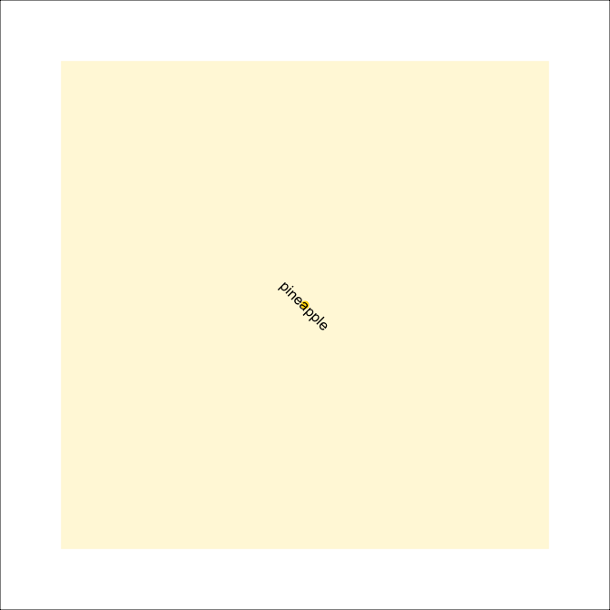
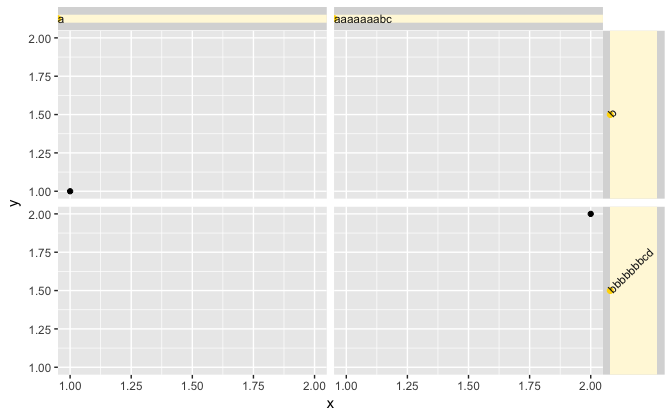
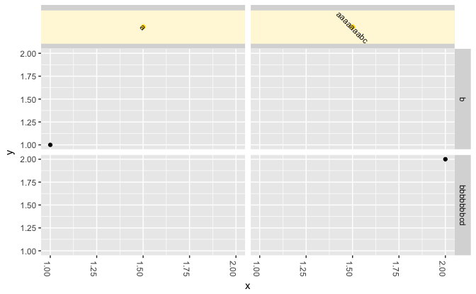

Testing position and rotation
================
Kara Woo
15 August, 2017

Placement of strip text is incorrect when the text is at angles other than 0, 90, 180, 270. Testing out some ways to improve this.

``` r
library("ggplot2")
library("grid")
```

``` r
display_tg <- function(label = "pineapple", ...) {
  tg <- ggplot2:::titleGrob(
                    label,
                    x = NULL,
                    y = NULL,
                    ...,
                    debug = TRUE
                  )
  
  grid.newpage()
  grid.rect()
  ## Draw tg in viewport that is smaller than the page (add_margins doesn't work
  ## for this)
  pushViewport(viewport(w = 0.8, h = 0.8, clip = "on"))
  grid.draw(tg)
}
```

Using [this commit](https://github.com/karawoo/ggplot2/commit/c655de255247feb2bcebb16c421eed37a6f4ca10):

``` r
sapply(c(0, 90, 180, 270), function(x) display_tg(hjust = 0, vjust = 0, angle = x))
```


    ## [[1]]
    ## NULL
    ## 
    ## [[2]]
    ## NULL
    ## 
    ## [[3]]
    ## NULL
    ## 
    ## [[4]]
    ## NULL

``` r
sapply(c(45, 135, 225, 315), function(x) display_tg(hjust = 0, vjust = 0, angle = x))
```


    ## [[1]]
    ## NULL
    ## 
    ## [[2]]
    ## NULL
    ## 
    ## [[3]]
    ## NULL
    ## 
    ## [[4]]
    ## NULL

``` r
sapply(c(45, 135, 225, 315), function(x) display_tg(hjust = 0.5, vjust = 0.5, angle = x))
```



    ## [[1]]
    ## NULL
    ## 
    ## [[2]]
    ## NULL
    ## 
    ## [[3]]
    ## NULL
    ## 
    ## [[4]]
    ## NULL

``` r
sapply(c(45, 135, 225, 315), function(x) display_tg(hjust = 1, vjust = 1, angle = x))
```


    ## [[1]]
    ## NULL
    ## 
    ## [[2]]
    ## NULL
    ## 
    ## [[3]]
    ## NULL
    ## 
    ## [[4]]
    ## NULL

Some sample plots:

``` r
df <- data.frame(
  x = 1:2,
  y = 1:2,
  z = c("a", "aaaaaaabc"),
  g = c("b", "bbbbbbbcd")
)

base <- ggplot(df, aes(x, y)) + 
  geom_point() +
  facet_grid(g ~ z)

base + 
  theme(
    strip.text.x = element_text(hjust = 0, debug = TRUE),
    strip.text.y = element_text(angle = 45, hjust = 0, debug = TRUE)
  )
```



``` r
base + 
  theme(
    strip.text.x = element_text(angle = 315, debug = TRUE),
    axis.text.x = element_text(angle = -90)
  )
```


